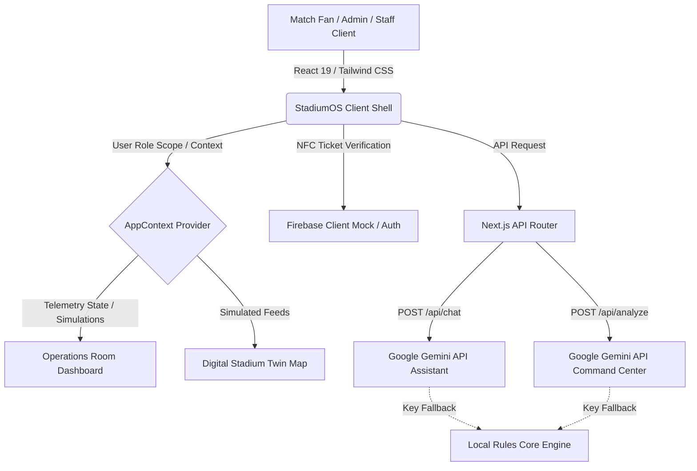

# StadiumOS AI
> **Tagline:** The AI Operating System for FIFA World Cup 2026.

StadiumOS AI is a production-ready, enterprise-grade Generative AI platform designed to manage and optimize stadium operations, tournament administration, and fan experiences across navigation, crowd dynamics, accessibility, transit logistics, and security during the FIFA World Cup 2026.

---

## 🏗️ System Architecture



---

## 🌟 Core Features

### 1. Digital Stadium Twin
* **Interactive Seating telemetry:** Rich SVG-based 2.5D visualizer of SoFi Stadium / MetLife Stadium.
* **Flow Overlays:** Dynamically toggling overlays for:
  * **Crowd Density:** Visual heatmaps showing sector occupancy levels.
  * **Accessibility (ADA) Routes:** Pathways mapping elevators, ramps, and dedicated drop-offs.
  * **Emergency Evacuation:** Flashing green directional egress paths bypassing congestion bottlenecks.
* **Interactive Incident Pins:** Flashing alert nodes on coordinates. Clicking lets operators manage/dispatch volunteers.

### 2. AI Command Center
* **Operational Prompts:** Natural language query processor responding to:
  * *"Which gate is most crowded?"*
  * *"Suggest the best evacuation strategy."*
  * *"Summarize current stadium operations."*
* **Automatic Fallbacks:** Instant rules-based analysis when Gemini credentials are in simulation mode.

### 3. Executive AI Summaries
* Aggregates real-time values (attendance load, active incident queues, transit schedules, eco indices) and generates an executive overview covering Crowd Intelligence, Logistics, Security Dispatch, and Sustainability.

### 4. Volunteer AI Optimizer
* Analyzes gate congestion and reallocates volunteers automatically (e.g. moving a guide from Main Concourse to Gate A to handle crowd bottleneck queues).

### 5. Emergency Decision Support
* Standardizes step-by-step checklists for emergency alerts (Cardiac medical emergencies, gate structural closures, weather storm events).

### 6. Accessibility Portal
* **WCAG AAA Compliance:** High-contrast toggle (black/white/yellow stylesheet) and Large Typography scale.
* **Screen Reader Simulator:** Simulates visual speech text blocks, integrated with native Web Speech API `speechSynthesis` to read telemetry updates out loud.
* **Voice glossary:** Guides users on available voice triggers.

### 7. Sustainability & Transit Planner
* **Carbon Calculator:** Compares Solo Car Driving vs Bus/Metro transit based on mileage, detailing grams of CO2 offset.
* **AI Green Travel Tips:** Encourages Metro Rail line boardings (integrated with free match tickets).

---

## 🛠️ Tech Stack

* **Frontend:** Next.js 15, React 19, TypeScript, Tailwind CSS, Lucide Icons.
* **Analytics:** Recharts (responsive Line, Area, and Bar timelines).
* **AI Integration:** Google Gemini API SDK (`@google/generative-ai` model `gemini-1.5-flash`).
* **Backend Simulators:** LocalStorage Firebase Auth, Firestore Incident dispatcher databases.
* **Animations:** Framer Motion, Canvas Confetti.

---

## 🚀 Installation & Local Setup

### Prerequisites
* **Node.js:** v18 or newer (v24 recommended)
* **npm:** v9 or newer

### Setup Steps
1. Clone the repository and navigate to the project directory:
   ```bash
   cd StadiumOS-AI
   ```

2. Install dependencies:
   ```bash
   npm install
   ```

3. Configure Environment Variables (Optional):
   Create a `.env.local` file in the root directory:
   ```env
   GEMINI_API_KEY=your_google_gemini_api_key_here
   ```
   *Note: If no API key is provided, the application runs on its integrated local telemetry simulator core, making it fully testable out-of-the-box.*

4. Launch the local dev server:
   ```bash
   npm run dev
   ```
   Open [http://localhost:3000](http://localhost:3000) in your browser.

5. Execute Telemetry Unit Tests:
   ```bash
   npm run test
   ```

---

## 🧪 Simulation Sandbox Guide

To test the resilience of StadiumOS AI:
1. Log in under the **Admin** or **Organizer** role.
2. Navigate to the **Admin Console** or **Operations Room**.
3. Toggle a scenario like **Gate Closure** or **Medical Emergency**.
4. Observe:
   * Active incident logs update.
   * Flashing incident node pins appear on the **Digital Twin Map**.
   * Recharts wait-time timelines spike to represent congestion.
   * The **AI Executive Briefing** generates active evacuation checklists.
5. In **Settings**, paste your personal Gemini API key to transition the app to live, responsive AI summaries instantly.

---

## 📄 License
This project is licensed under the MIT License - see the LICENSE file for details.
FIFA World Cup 2026 is a trademark of FIFA. This application is an operations platform simulator designed for tournament venue management.
